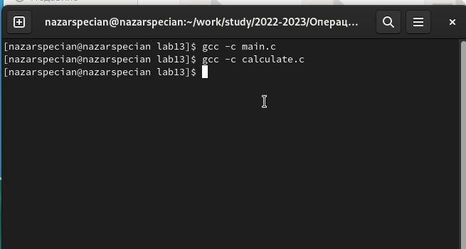
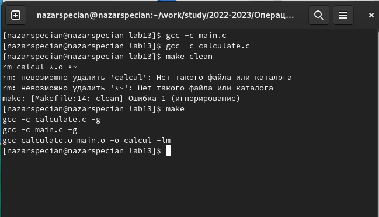
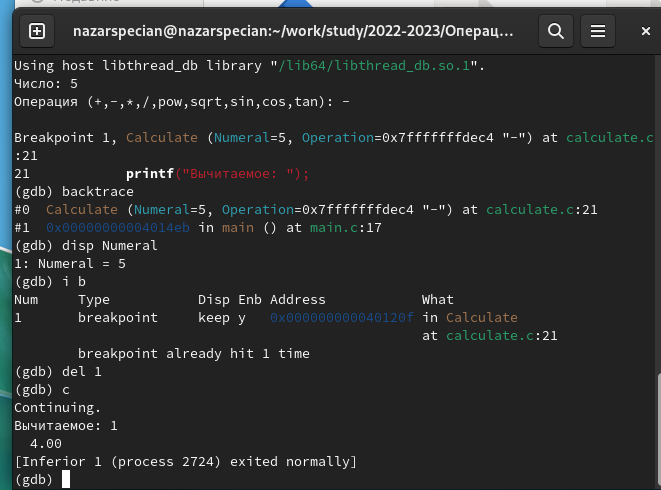
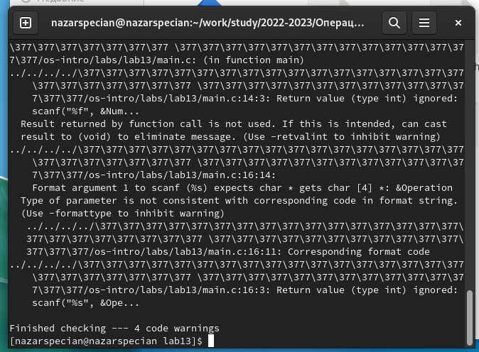

---
# Front matter
lang: ru-RU
title: "Отчёт по лабораторной работе №13"
subtitle: "Средства для создания приложений в ОС UNIX"
author: "Назар Специан"

# Formatting
toc-title: "Содержание"
toc: true # Table of contents
toc_depth: 2
lof: true # List of figures
fontsize: 12pt
linestretch: 1.5
papersize: a4paper
documentclass: scrreprt
polyglossia-lang: russian
polyglossia-otherlangs: english
mainfont: PT Serif
romanfont: PT Serif
sansfont: PT Sans
monofont: PT Mono
mainfontoptions: Ligatures=TeX
romanfontoptions: Ligatures=TeX
sansfontoptions: Ligatures=TeX,Scale=MatchLowercase
monofontoptions: Scale=MatchLowercase
indent: true
pdf-engine: lualatex
header-includes:
  - \linepenalty=10 # the penalty added to the badness of each line within a paragraph (no associated penalty node) Increasing the value makes tex try to have fewer lines in the paragraph.
  - \interlinepenalty=0 # value of the penalty (node) added after each line of a paragraph.
  - \hyphenpenalty=50 # the penalty for line breaking at an automatically inserted hyphen
  - \exhyphenpenalty=50 # the penalty for line breaking at an explicit hyphen
  - \binoppenalty=700 # the penalty for breaking a line at a binary operator
  - \relpenalty=500 # the penalty for breaking a line at a relation
  - \clubpenalty=150 # extra penalty for breaking after first line of a paragraph
  - \widowpenalty=150 # extra penalty for breaking before last line of a paragraph
  - \displaywidowpenalty=50 # extra penalty for breaking before last line before a display math
  - \brokenpenalty=100 # extra penalty for page breaking after a hyphenated line
  - \predisplaypenalty=10000 # penalty for breaking before a display
  - \postdisplaypenalty=0 # penalty for breaking after a display
  - \floatingpenalty = 20000 # penalty for splitting an insertion (can only be split footnote in standard LaTeX)
  - \raggedbottom # or \flushbottom
  - \usepackage{float} # keep figures where there are in the text
  - \floatplacement{figure}{H} # keep figures where there are in the text
---

# Цель работы

Приобрести простейшие навыки разработки, анализа, тестирования и отладки приложений в ОС типа UNIX/Linux на примере создания на языке программирования С калькулятора с простейшими функциями.

# Выполнение лабораторной работы

1. Создали подкаталог для файлов лаб работы 

2. Создал в нём файлы: calculate.h , calculate.c , main.c .
Это будет примитивнейший калькулятор, способный складывать, вычитать, умножать и делить, возводить число в степень, брать квадратный корень, вычислять sin, cos, tan. При запуске он будет запрашивать первое число, операцию, второе число. После этого программа выведет результат и остановится.

Код файла calculate.с (реализует функции калькулятора)

```
////////////////////////////////////
// calculate.c

#include <stdio.h>
#include <math.h>
#include <string.h>
#include "calculate.h"

Float Calculate(float Numeral, char Operation[4])
{
  float SecondNumeral;
  if(strncmp(Operation, "+", 1) == 0)
    {
      printf("Второе слагаемое: ");
      scanf("%f",&SecondNumeral);
      return(Numeral + SecondNumeral);
    }
  else if(strncmp(Operation, "-", 1) == 0)
    {
      printf("Вычитаемое: ");
      scanf("%f",&SecondNumeral);
      return(Numeral - SecondNumeral);
    }
  else if(strncmp(Operation, "*", 1) == 0)
    {
      printf("Множитель: ");
      scanf("%f",&SecondNumeral);
      return(Numeral * SecondNumeral);
    }
  else if(strncmp(Operation, "/", 1) == 0)
    {
      printf("Делитель: ");
      scanf("%f",&SecondNumeral);
      if(SecondNumeral == 0)
	{
	  printf("Ошибка: деление на ноль! ");
	  return(HUGE_VAL);
	}
      else
	return(Numeral / SecondNumeral);
    }
  else if(strncmp(Operation, "pow", 3) == 0)
    {
      printf("Степень: ");
      scanf("%f",&SecondNumeral);
      return(pow(Numeral, SecondNumeral));
    }
  else if(strncmp(Operation, "sqrt", 4) == 0)
    return(sqrt(Numeral));
  else if(strncmp(Operation, "sin", 3) == 0)
    return(sin(Numeral));
  else if(strncmp(Operation, "cos", 3) == 0)
    return(cos(Numeral));
  else if(strncmp(Operation, "tan", 3) == 0)
    return(tan(Numeral));
  else
    {
      printf("Неправильно введено действие ");
      return(HUGE_VAL);
    }
}
```

Код файла calculate.h (описывает формат вызова функции калькулятора)

```
///////////////////////////////////////
// calculate.h
#ifndef CALCULATE_H_
#define CALCULATE_H_
float Calculate(float Numeral, char Operation[4]);
#endif /*CALCULATE_H_*/

Код файла main.c (реализует интерфейс пользователя к калькулятору)
////////////////////////////////////////
// main.c

#include <stdio.h>
#include "calculate.h"

Int main (void)
{
  float Numeral;
  char Operation[4];
  float Result;
  printf("Число: ");
  scanf("%f",&Numeral);
  printf("Операция (+,-,*,/,pow,sqrt,sin,cos,tan): ");
  scanf("%s",&Operation);
  Result = Calculate(Numeral, Operation);
  printf("%6.2f\n",Result);
  return 0;
}
```

3. Выполнили компиляцию программы посредством gcc :

{ #fig:001 width=70% }

4. При необходимости исправили синтаксические ошибки.

5. Создали Makefile со следующим содержанием:

```
#
# Makefile
#
CC = gcc
CFLAGS = -g
LIBS = -lm
calcul: calculate.o main.o
gcc calculate.o main.o
-o calcul $(LIBS)
calculate.o: calculate.c calculate.h
gcc -c calculate.c $(CFLAGS)
main.o: main.c calculate.h
gcc -c main.c $(CFLAGS)
clean:
-rm calcul *.o *~
# End Makefile
```

С помощью программы make получаем различные варианты построения исполняемого модуля.

{ #fig:002 width=70% }

4. С помощью gdb выполнил отладку программы calcul

{ #fig:003 width=70% }

{ #fig:004 width=70% }

{ #fig:005 width=70% }

5. С помощью утилиты splint попробовали проанализировать коды файлов

{ #fig:006 width=70% }

# Вывод

Приобрели простейшие навыки разработки, анализа, тестирования и отладки приложений в ОС типа UNIX/Linux на примере создания на языке программирования С калькулятора с простейшими функциями.

# Контрольные вопросы

1. Как получить информацию о возможностях программ gcc, make, gdb и др.? 
Ответ: Для этого есть команда man и предлагающиеся к ней файлы. 

2. Назовите и дайте краткую характеристику основным этапам разработки прило- жений в UNIX. 
Ответ: Кодировка, Компиляция, Тест. 

3. Что такое суффикс в контексте языка программирования? Приведите примеры использования. 
Ответ: Это расширения файлов. 

4. Каково основное назначение компилятора языка С в UNIX? 
Ответ: Программа gcc, которая интерпретирует к определенному языку программирования аргументы командной строки и определяет запуск нужного компилятора для нужного файла. 

5. Для чего предназначена утилита make? 
Ответ: Для компиляции группы файлов. Собрания из них программы, и последующего удаления. 

6. Приведите пример структуры Makefile. Дайте характеристику основным элементам этого файла. 
Ответ:  
```
program: main.o lib.o  
cc -o program main.o lib.o  
main.o lib.o: defines.h 
```
В имени второй цели указаны два файла и для этой же цели не указана команда компиляции. Кроме того, нигде явно неуказана зависимость объектных файлов от «*.c»-файлов. Дело в том, что программа make имеет предопределённые правила для получения файлов с определёнными расширениями. Так, для цели-объектного файла (расширение «.o») при обнаружении соответствующего файла с расширением «.c» будет вызван компилятор «сс -с» с указанием в параметрах этого «.c»-файла и всех файлов-зависимостей. 

7. Назовите основное свойство, присущее всем программам отладки. Что необходимо сделать, чтобы его можно было использовать? 
Ответ: Программы для отладки нужны для нахождения ошибок в программе. Для их использования надо скомпилировать программу таким образом, чтобы отладочная информация содержалась в конечном бинарном файле. 

8. Назовите и дайте основную характеристику основным командам отладчика gdb. 
Ответ: 

backtrace – выводит весь путь к текущей точке останова, то есть названия всех функций, начиная от main(); иными словами, выводит весь стек функций; 

break – устанавливает точку останова; параметром может быть номер строки или название функции; 

clear – удаляет все точки останова на текущем уровне стека (то есть в текущей функции); 

continue – продолжает выполнение программы от текущей точки до конца; 

delete – удаляет точку останова или контрольное выражение; 

display – добавляет выражение в список выражений, значения которых отображаются каждый раз при остановке программы; 

finish – выполняет программу до выхода из текущей функции; отображает возвращаемое значение,если такое имеется; 

info breakpoints – выводит список всех имеющихся точек останова; 

info watchpoints – выводит список всех имеющихся контрольных выражений; 

list – выводит исходный код; в качестве параметра передаются название файла исходного кода, затем, через двоеточие, номер начальной и конечной строки; 

next – пошаговое выполнение программы, но, в отличие от команды step, не выполняет пошагово вызываемые функции; 

print – выводит значение какого-либо выражения (выражение передаётся в качестве параметра); 

run – запускает программу на выполнение; 

set – устанавливает новое значение переменной 

step – пошаговое выполнение программы; 

watch – устанавливает контрольное выражение, программа остановится, как только значение контрольного выражения изменится; 
 
9. Опишите по шагам схему отладки программы, которую Вы использовали при выполнении лабораторной работы. 
Ответ:  
1. gdb --silent ./calcul 
2. run 
3. list 
4. backtrace 
5. breakpoints  
6. print Numeral 
7. Splint (Не использовался по причине отсутствия команды в консоли). 

10. Прокомментируйте реакцию компилятора на синтаксические ошибки в программе при его первом запуске. 
Ответ: Консоль выводит ошибку с номером строки и ошибочным сегментом, но при этом есть возможность выполнить программу сразу. 

11. Назовите основные средства, повышающие понимание исходного кода программы. 
Ответ: 
 a) Правильный синтаксис 
b) Наличие комментариев 
c) Разбиение большой сложной программы на несколько сегментов попроще. 

12. Каковы основные задачи, решаемые программой splint? 
Ответ: split – разбиение файла на меньшие, определённого размера. Может разбивать текстовые файлы по строкам и любые – по байтам. По умолчанию читает со стандартного ввода и создает файлы с именами вида xaa, xab и т.д. По умолчанию разбиение идёт по 1000 строк в файле. 

